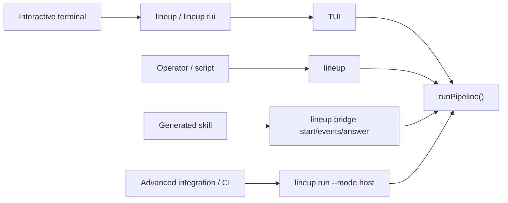

# CLI Overview

Lineup has one engine and two frontends:

- the interactive frontend, where `lineup` opens the TUI in a terminal and `lineup tui` is the explicit alias
- the operator frontend, where `lineup <subcommand>` stays available for scripts, maintenance, and CI

The same engine powers both frontends and the detached bridge used by generated skills. The TUI does not introduce a separate orchestrator; it renders the same run state, readiness checks, and artifact data that the command layer already uses.

Relevant implementation files:

- `cli/src/cli.ts` - command registration and dispatch
- `cli/src/lib/run-pipeline.ts` - orchestration engine
- `cli/src/commands/bridge.ts` - detached bridge session lifecycle
- `cli/src/lib/bridge.ts` - bridge session and event persistence
- `cli/src/lib/executor.ts` - native implement/verify execution
- `cli/src/lib/protocol.ts` - raw host protocol types

## Frontends

`--no-tui` is the escape hatch when you want the interactive terminal path to stay in classic text mode.

## Shared Runtime

Everything still flows through `runPipeline()`. It loads the workflow or tactic, validates the workflow DAG and project prerequisites, creates the run state under `.lineup`, acquires the runtime lock, resolves execution waves, and runs the stages.

The default full pipeline remains:

`Triage -> Clarify -> Research -> Clarification Gate -> Plan -> Implement -> Verify -> Document?`

Not every task runs every stage. Triage can reduce the task to a lighter path when the scope is simple.

The `implement` and `verify` stages still compile the approved plan into executable tasks and waves, run implementation in isolated workspaces, and then produce review and verification output. That split is what makes task-wave inspection, targeted retry, and artifact comparison practical.

## Human, Host, and Bridge

`lineup run` still supports two runtime modes:

- `human` - interactive terminal use. The TUI is the normal human surface.
- `host` - NDJSON protocol output for skills, automation, and CI.

If omitted, `--mode` defaults to `human` on a TTY and `host` otherwise.

Generated skills should prefer the bridge API instead of supervising raw host protocol:

- `lineup bridge start` launches a CLI-owned detached session
- `lineup bridge events` returns compact replayable `status`, `question`, and `complete` events plus reconnect-safe `session`, `pendingQuestion`, and `recovery` fields
- `lineup bridge answer` responds to pending bridge questions

Bridge sessions persist more than a cursor. They keep the unresolved gate and recovery state so a host can reconnect cleanly after interruptions. The same persistence also powers `lineup show`, `lineup logs`, `lineup replay`, `lineup resume`, and `lineup bridge events`.

## Recovery and Artifacts

The CLI keeps run state and artifacts on disk so inspection and resume stay deterministic:

- pipeline state for resume and inspection
- plan, tasks, review, and protocol artifacts
- bridge session and event files for detached runs
- pending gate requests and responses

That persistence lets the TUI show live progress, the operator commands inspect completed runs, and generated skills recover blocked sessions without re-running work blindly.

## Where To Read Next

- [TUI guide](./tui.md)
- [Commands](./commands.md)
- [Pipeline](./pipeline.md)
- [Gate Protocol](./gate-protocol.md)
