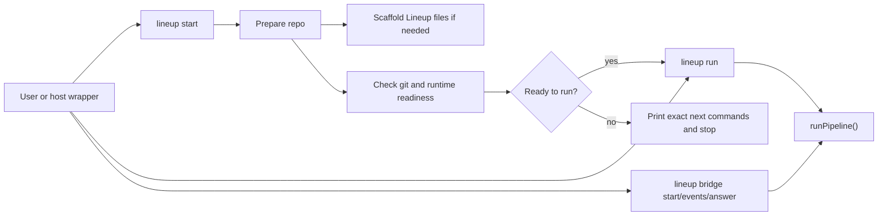
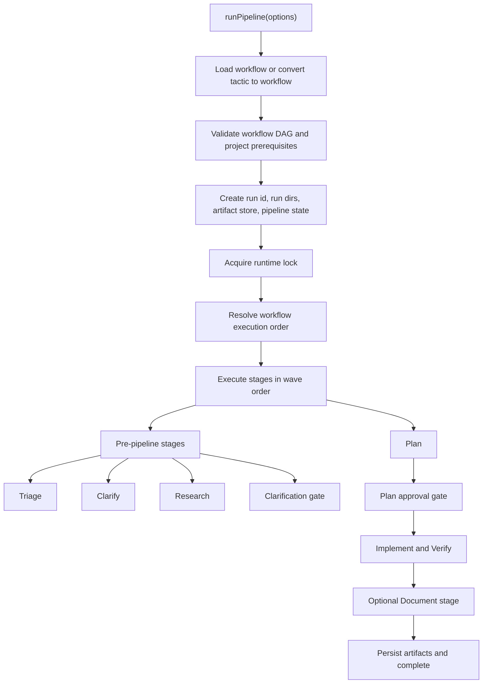
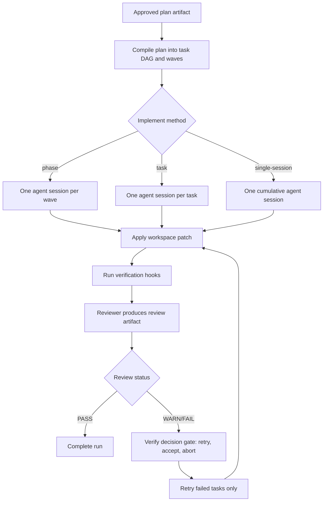
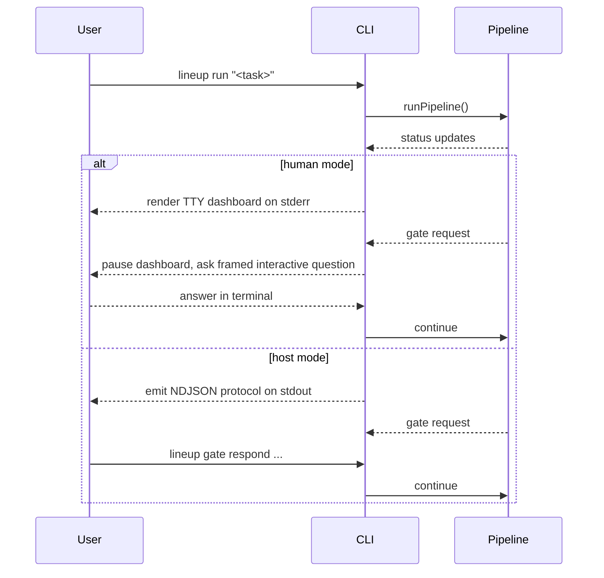
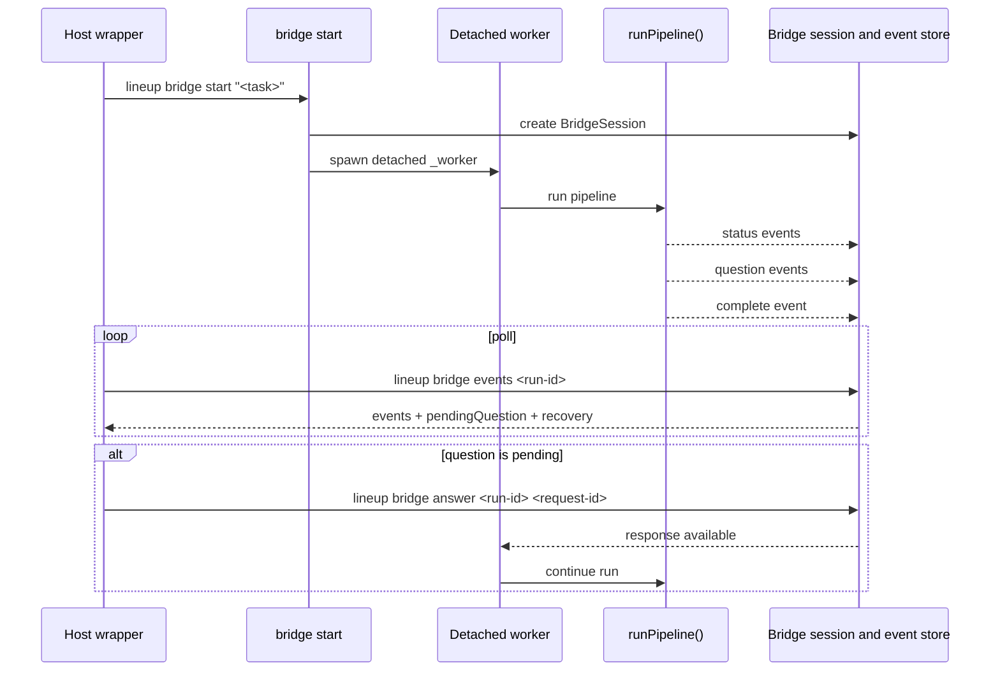

# CLI Overview

This document explains how the `lineup` CLI works as a runtime, not just as a command list.

At a high level, the CLI is the engine. Host skills for Claude Code, Codex CLI, and OpenCode are wrappers around that same engine rather than separate orchestrators.

Relevant implementation files:

- `cli/src/cli.ts` — command registration and dispatch
- `cli/src/commands/start.ts` — first-run preparation and readiness checks
- `cli/src/commands/run.ts` — direct execution entrypoint and mode selection
- `cli/src/commands/bridge.ts` — detached bridge session lifecycle
- `cli/src/lib/run-pipeline.ts` — orchestration engine
- `cli/src/lib/executor.ts` — native implement/verify execution
- `cli/src/lib/bridge.ts` — bridge session and event persistence

## Mental model

Lineup has three practical entrypoints:

- `lineup start` for first-run or onboarding flows
- `lineup run` for direct terminal execution
- `lineup bridge start|events|answer` for generated host wrappers

## Command roles

`lineup start` is the safest first entrypoint in a repo. It initializes Lineup structure if needed, runs readiness checks, and only delegates to `run` when the project is actually ready.

`lineup run` is the normal direct executor. It resolves the runtime mode automatically:

- `human` on an interactive TTY
- `host` otherwise

In `human` mode, progress and questions are shown for a person in the terminal. In `host` mode, the CLI emits protocol messages and waits for gate responses through CLI commands.

Human mode now uses a shared terminal UI layer:

- active run UI is written to `stderr`
- TTY runs mount a dynamic dashboard with live timers, stage attempts, pending gates, artifact hints, and next actions
- non-TTY runs degrade to append-only plain text with ASCII-safe symbols
- interactive gate prompts temporarily suspend the dashboard and keep prompt I/O on `stderr`
- the same formatting vocabulary is reused for non-TTY runs, `show --watch`, bridge text mode, and interactive gate prompts

`lineup bridge` exists so installed host skills do not need to supervise raw protocol streams directly. The bridge starts a detached worker, persists a session, converts low-level protocol messages into compact events, and supports reconnect-safe polling.

## Pipeline execution

The orchestration engine lives in `runPipeline()`. It loads a workflow or tactic, validates it, creates a run id and state directories, acquires a runtime lock, resolves execution waves, and then executes stages.

The default full pipeline is:

`Triage -> Clarify -> Research -> Clarification Gate -> Plan -> Implement -> Verify -> Document?`

Not every task runs every stage. Triage can reduce the task to a lighter path when the scope is simple.

## What happens inside Implement and Verify

The `implement` and `verify` stages are special. They do not behave like the earlier orchestration stages.

The engine first reads the approved plan artifact, compiles it into executable tasks and waves, runs implementation in isolated workspaces, and then runs review plus verification hooks.

This split is why Lineup can:

- show task waves with `lineup waves`
- retry only failed implementation work after review
- keep plan, tasks, review, and protocol as separate inspectable artifacts

## Human mode vs host mode

Both modes use the same engine. The difference is how questions and progress are surfaced.

`host` mode is the low-level integration path. It is appropriate for CI or advanced custom integrations that want raw protocol messages.

Generated skills should usually prefer the bridge API instead.

## Bridge mode

Bridge mode wraps the same pipeline engine in a detached, replayable session that host skills can poll safely.

The important design point is that bridge sessions persist more than a cursor. They also keep the unresolved gate and recovery state, which lets a host reconnect cleanly after interruptions.

## State and artifacts

Each run gets a persistent state bundle under `.lineup`. In practice, the CLI stores:

- pipeline state for resume and inspection
- optional `stage_state` and `pending_gate` snapshots for live UI and recovery
- artifacts such as plan, tasks, review, and protocol
- bridge session and bridge event files for detached runs
- pending gate requests and responses

That persistence is what makes `lineup show`, `lineup logs`, `lineup replay`, `lineup resume`, and `lineup bridge events` practical instead of best-effort.

## Why the architecture is split this way

Lineup keeps orchestration inside the CLI so behavior stays consistent across hosts.

That gives the project a few useful properties:

- one runtime contract instead of per-host orchestration logic
- one bridge contract for generated skills
- one place to add output normalization, retries, and validation
- one persistent run model for inspection and resume

If you need the lower-level details after this overview, continue with:

- [Architecture](./architecture.md)
- [Commands](./commands.md)
- [Pipeline](./pipeline.md)
- [Gate Protocol](./gate-protocol.md)
