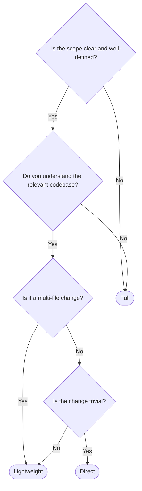

# Pipeline Tiers

Not every task needs the full 7-stage pipeline. Lineup supports three tiers that trade thoroughness for speed, letting the orchestrator match the workflow to the task's complexity.

## The three tiers

| Tier | Stages | Time | Cost |
| ---- | ------ | ---- | ---- |
| **Full** | Clarify, Research, Clarification Gate, Plan, Implement, Verify, Document? | Longest | Highest |
| **Lightweight** | Plan, Implement, Verify | Moderate | Moderate |
| **Direct** | Just do it | Fastest | Lowest |

### Full

:::info Full Pipeline

Clarify → Research → Clarification Gate → Plan → Implement → Verify → Document?

:::

The complete pipeline. Every stage runs (except Document, which is always optional). Use this when the task is complex, the requirements are unclear, or you're working in unfamiliar code.

**Examples:**
- "Refactor the authentication module to use JWT tokens"
- "Add a caching layer to the API"
- "Migrate the database from MySQL to PostgreSQL"

### Lightweight

:::info Lightweight Pipeline

Plan → Implement → Verify

:::

Skips clarification and research. Starts directly with planning. Use this when you already understand the scope and the codebase -- you just need a plan, execution, and validation.

**Examples:**
- "Add a loading spinner to the user list component"
- "Extract the validation logic into a shared utility"
- "Update the API response format to include pagination metadata"

### Direct

:::info Direct

Just do it

:::

No pipeline stages at all. The orchestrator delegates directly to a developer (or handles it inline). Use this for trivial changes where the overhead of planning would exceed the work itself.

**Examples:**
- "Fix the typo in the README"
- "Change the button color from blue to green"
- "Update the copyright year in the footer"

## Decision tree

Use this to pick the right tier for your task:

## How the orchestrator chooses

You don't need to specify a tier explicitly. The orchestrator infers it from your input:

- **Vague or broad requests** trigger Full tier: "Improve the performance of the app" gives no clear scope, so the orchestrator starts with clarification and research.
- **Specific, scoped requests** trigger Lightweight: "Add input validation to the LoginForm component using Zod" has clear scope and approach, so the orchestrator skips to planning.
- **Trivial, explicit requests** trigger Direct: "Fix the typo on line 42 of README.md" is so specific that planning would be overhead.

You can also influence the tier by being more or less specific in your request. A detailed request with clear requirements naturally leads to a lighter pipeline.

::: tip
When in doubt, the orchestrator defaults to the Full pipeline. It's cheaper to skip a stage that turns out unnecessary than to redo work because a needed stage was skipped.
:::

## Overriding the tier

If the orchestrator picks a tier you disagree with, you can say so:

- "Skip research, I know this codebase well" -- pushes toward Lightweight
- "Let's do the full pipeline on this one" -- forces Full
- "Just make the change" -- forces Direct

The orchestrator respects these cues and adjusts accordingly.

## Tiers vs. tactics

Tiers are about how much of the default pipeline to run. [Tactics](/concepts/tactics) are about defining a completely custom stage sequence. They solve different problems:

- **Tiers** adjust the *depth* of the default pipeline
- **Tactics** change the *shape* of the pipeline entirely

A tactic might define only two stages (like the `explain` tactic with Research + Explain), or it might define five stages with custom prompts and approval gates. Tactics don't map to tiers -- they are their own workflows.

For an interactive guide to choosing the right approach for your task, see [Choose a Pipeline Tier](/guides/choose-tier).
