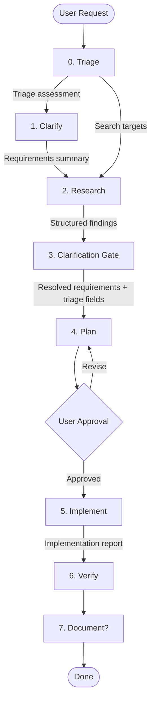

# The Pipeline

Lineup organizes work into a pipeline with up to 8 stages (Stage 0 through Stage 7). Each stage has a specific purpose, and the output of one stage feeds into the next.

## Overview

## Stage-by-stage breakdown

### Stage 0: Triage

**What it does:** The orchestrator performs a fast, lightweight analysis of the user's prompt before entering the pipeline. No agent is spawned -- this is pure orchestrator reasoning.

**Why it exists:** Without triage, every downstream stage must independently figure out what the task involves. Triage front-loads this analysis once, producing structured fields that drive research scoping, conditional approach selection, and parallel architect spawning.

**What gets passed to the next stages:** A triage assessment containing `affected_areas`, `complexity` (simple/moderate/complex), `search_targets`, and `independent_areas`.

**How it works:** The orchestrator reads the user's prompt and classifies the task. For each affected area, it notes whether it is independent or coupled with other areas. It produces concrete search targets (specific directories, file patterns, questions) that researchers will use as focused directives. This assessment is not shown to the user as a separate gate -- it feeds directly into Stages 1 and 2.

### Stage 1: Clarify

**What it does:** The orchestrator analyzes the user's request and asks targeted questions to fill in gaps -- missing requirements, ambiguous scope, edge cases, non-functional constraints.

**Why it exists:** Building the wrong thing is the most expensive mistake. Five minutes of clarification saves hours of rework.

**What gets passed to the next stage:** A concise requirements summary with all decisions locked in.

**How it works:** The orchestrator uses structured questions with predefined options (3-5 per question, always including a free-text option). Related questions are batched together. If the request is already specific and unambiguous, this stage is skipped.

### Stage 2: Research

**What it does:** One or more researcher agents explore the codebase. They read files, search for patterns, check documentation, and gather context.

**Why it exists:** Research by dedicated read-only agents keeps exploration out of the main context window. The orchestrator stays lean while researchers dig deep.

**What gets passed to the next stage:** Structured findings in YAML format -- key files, classes, functions, data structures, execution flow, architectural patterns, constraints, and gaps.

**How it works:** Researchers receive the triage assessment's search targets as focused directives -- specific directories, file patterns, and questions -- rather than deriving scope from scratch. They run in parallel when investigating independent areas, or sequentially when findings build on each other. They cannot modify files -- read-only access ensures safe exploration.

### Stage 3: Clarification Gate

**What it does:** The orchestrator reviews research findings and identifies remaining ambiguities -- unresolved edge cases, scope boundaries, conflicting patterns, integration decisions.

**Why it exists:** Research often uncovers things that weren't obvious from the initial request. This gate catches those before planning begins.

**What gets passed to the next stage:** Final resolved requirements, ready for planning.

**How it works:** Like the Clarify stage, the orchestrator presents each ambiguity as a structured question with resolution options based on what the research found. If the research was clean with no open questions, this gate is skipped automatically.

### Stage 4: Plan

**What it does:** An architect agent synthesizes all findings and requirements into an implementation plan. The plan specifies files to create or modify, changes to make, acceptance criteria, and a parallelization strategy.

**Why it exists:** Planning with user approval catches issues before any code is written. It also gives the developer agents a clear specification to follow instead of improvising.

**What gets passed to the next stage:** An approved implementation plan.

**How it works:** The triage assessment's `complexity` and `independent_areas` fields drive how this stage runs. Simple tasks get a single approach directly (no multi-approach comparison), while moderate and complex tasks get 2-3 approaches with trade-offs. When triage detects 2+ independent areas, separate architect agents spawn in parallel -- each scoped to its area -- and the orchestrator merges their outputs into a single master plan. After producing the plan, the orchestrator presents it to the user and **waits for explicit approval**. The user can approve, reject, or suggest changes.

### Stage 5: Implement

**What it does:** One or more developer agents write code following the approved plan.

**Why it exists:** Separating implementation from planning ensures the code matches what was approved. Developers follow the plan -- no improvising beyond the approved scope.

**What gets passed to the next stage:** An implementation report listing all changes made, along with the actual code changes in the project.

**How it works:** Developers follow the architect's parallelization strategy. Independent work runs in parallel batches; dependent work runs sequentially. Each developer receives the full plan as context.

### Stage 6: Verify

**What it does:** A reviewer agent runs tests, reviews the diff against the plan, and checks for regressions.

**Why it exists:** Catching bugs before the user sees the result saves a round-trip of "this doesn't work, fix it."

**What gets passed to the next stage:** A verification report with pass/fail status.

**How it works:** The reviewer receives the plan, the implementation report, and runs project tests. It flags any issues -- it does not silently pass a broken implementation.

### Stage 7: Document (Optional)

**What it does:** If the user opts in, a documenter agent writes or updates project documentation based on the changes made.

**Why it exists:** Documentation is often skipped when developers are tired after implementation. Making it a one-click optional step at the end removes friction.

**What gets passed to the user:** A documentation report listing what files were created or updated.

**How it works:** The orchestrator asks the user whether to generate documentation. If yes, the documenter receives the plan, implementation report, and review report as context, then writes docs directly to the project.

## Pipeline tiers

Not every task needs all 7 stages. The orchestrator can compress the pipeline based on complexity:

| Tier | Pipeline | Use when |
| ---- | -------- | -------- |
| **Full** | Triage, Clarify, Research, Clarification Gate, Plan, Implement, Verify, Document? | Complex multi-file changes, unclear requirements, unfamiliar code |
| **Lightweight** | Triage, Plan, Implement, Verify | Moderate tasks, scope is understood, single module |
| **Direct** | Just do it | Simple fixes, single file, explicit instructions |

See [Pipeline Tiers](/concepts/pipeline-tiers) for detailed guidance on choosing the right tier.

## When stages can be skipped

The pipeline is designed to be flexible:

- **Triage** always runs for Full and Lightweight tiers. It is skipped only in Direct tier.
- **Clarify** is skipped when the request is already specific and unambiguous.
- **Clarification Gate** is skipped when research yields clear, complete answers with no open questions.
- **Document** is always optional -- the user chooses at the end.
- **The clarification and research stages** (Clarify, Research, Clarification Gate) are skipped in Lightweight tier when the scope is already clear. Triage still runs to inform planning.

The orchestrator makes these decisions based on the task description and what it learns at each stage. When in doubt, it runs the full pipeline -- it's cheaper to skip a stage that turns out unnecessary than to redo work because a needed stage was skipped.

## Tactics override the pipeline

[Tactics](/concepts/tactics) let you define custom stage sequences for recurring task patterns. When a tactic is selected, its stage list replaces the default 7-stage pipeline entirely. The same agents and context-passing mechanisms apply, but the stages and their order come from the tactic definition.

## Context snapshots

When the orchestrator passes output from one stage to the next, it does not forward the entire conversation history. Instead, it creates a **context snapshot** -- a curated subset of the upstream output that contains only the sections relevant to the downstream agent.

For example, when transitioning from Research to Plan, the snapshot includes the full research YAML. When transitioning from Plan to Implement, the snapshot includes only the `changes`, `parallelization_strategy`, and `acceptance_criteria` sections of the plan -- not the approaches analysis or risk assessment. The Plan to Verify transition is even leaner: only `acceptance_criteria` is forwarded, saving 8-12k tokens compared to passing the full plan.

This selective forwarding keeps downstream agents focused on what they need and reduces token cost. The user can always ask to see any document from any stage -- snapshots control what agents receive, not what the user can access.

See the kick-off stage snapshot table in `.lineup-core/skills/kick-off/core.md` for the complete list of transitions.
