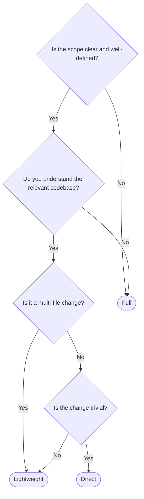

# Choose a Pipeline Tier

This guide helps you pick the right [pipeline tier](/concepts/pipeline-tiers) for your task. It covers when to use each tier, what questions to ask yourself, and how the orchestrator makes its decision.

## The decision tree

Start at the top and follow the path that matches your situation:

## Questions to ask yourself

Before you run the pipeline, a few quick questions can tell you which tier fits:

**Do I know exactly what needs to change?** If you can name the specific files and describe the exact changes, you probably don't need the Clarify stage. That points to Lightweight or Direct.

**Am I familiar with this part of the codebase?** If the code is unfamiliar -- you're working in a module someone else wrote, or a part of the project you haven't touched -- Research will save you time. That points to Full.

**Is there more than one reasonable approach?** If you're not sure whether to add a new file vs modify an existing one, or which pattern to follow, the Plan stage will help sort it out. That rules out Direct.

**Could I describe this change in one sentence?** "Fix the typo on line 42" or "change the button color to green" are Direct-tier tasks. If the description takes a paragraph, it's at least Lightweight.

## Real examples at each tier

### Full tier

> "Refactor the authentication module to use JWT tokens"

Unclear how deep the refactor goes, which files are affected, what the JWT implementation should look like. Needs Clarify, Research, and Plan before any code is written.

> "Add a caching layer to the API"

Broad scope, multiple implementation options, requires understanding current data flow. Full pipeline prevents building the wrong cache strategy.

> "Migrate the database from MySQL to PostgreSQL"

Touches many files, has hidden dependencies (query syntax differences, driver changes, migration scripts). Research is essential.

### Lightweight tier

> "Add a loading spinner to the user list component"

Clear scope (one component), known location, specific change. Start with a plan to decide spinner placement and state management, then implement and verify.

> "Extract the validation logic into a shared utility"

You know what to extract and where it lives. A plan ensures the refactor is done safely, then implementation follows.

> "Update the API response format to include pagination metadata"

Specific change, known files, clear requirements. Plan, build, test.

### Direct tier

> "Fix the typo in the README"

One file, one line. Planning this would take longer than doing it.

> "Change the button color from blue to green"

Trivial CSS change. No ambiguity, no dependencies.

> "Update the copyright year in the footer"

Self-explanatory, single change.

## When the orchestrator auto-selects

You don't need to specify a tier. The orchestrator infers it from your request:

- **Vague or broad requests** trigger Full: "Improve the performance of the app" has no clear scope, so clarification and research are needed.
- **Specific, scoped requests** trigger Lightweight: "Add input validation to the LoginForm component using Zod" has clear scope and approach.
- **Trivial, explicit requests** trigger Direct: "Fix the typo on line 42 of README.md" is so specific that planning would be overhead.

The more specific your request, the lighter the pipeline. A detailed description with clear requirements naturally skips the early stages.

::: tip
When in doubt, the orchestrator defaults to the Full pipeline. It's cheaper to skip a stage that turns out unnecessary than to redo work because a needed stage was skipped.
:::

## How to explicitly request a tier

If the orchestrator picks a tier you disagree with, you can override it by saying so:

| What you want | What to say |
| ------------- | ----------- |
| Force Full pipeline | "Let's do the full pipeline on this one" |
| Skip to Lightweight | "Skip research, I know this codebase well" |
| Go Direct | "Just make the change" or "just do it" |
| Start over with more structure | "Actually, let's start with clarification" |

The orchestrator respects these cues and adjusts accordingly.

## Tiers vs. tactics

Tiers and [tactics](/concepts/tactics) solve different problems:

- **Tiers** adjust the *depth* of the default pipeline (how many stages to run)
- **Tactics** change the *shape* of the pipeline entirely (which stages, in what order, with what prompts)

A Full-tier run uses the default 7-stage sequence. A tactic might define only 2 stages with custom prompts and approval gates. If you find yourself wanting a specific stage sequence for a recurring task, create a tactic rather than relying on tier selection.
